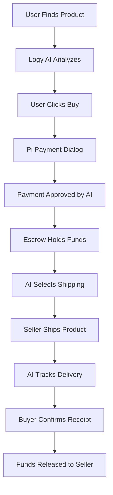
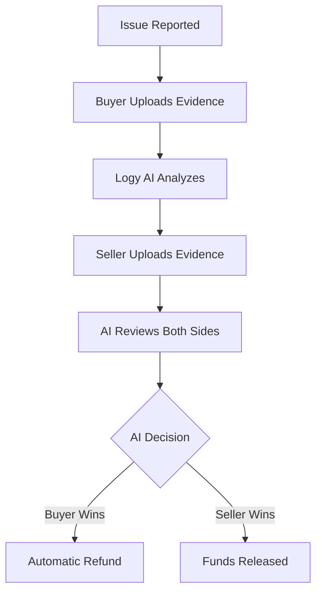

# 🤖 Forsale AI - Global AI-Powered Marketplace

<div align="center">


**The World's First Fully Automated Marketplace**  
*Powered by Pi Network & Advanced AI*

[](https://opensource.org/licenses/MIT)
[](https://minepi.com)
[](https://forsale0409.minepiapp.com)

[Live Demo](https://forsale0409.minepiapp.com) | [Documentation](https://github.com/mohamedawnyelsaby/pi-forsale) | [Report Bug](https://github.com/mohamedawnyelsaby/pi-forsale/issues)


</div>

---

## 🌟 What is Forsale AI?

Forsale AI is a **revolutionary global marketplace** where **artificial intelligence handles everything** from product listing to dispute resolution. **Zero human intervention required**.

### 🎯 Key Differentiators

| Traditional Marketplaces | Forsale AI |
|-------------------------|------------|
| Manual product listing | AI analyzes images & generates listings |
| Human customer support | 24/7 AI chat support (Logy AI) |
| Slow dispute resolution | AI resolves disputes in 24-48 hours |
| Limited shipping options | AI selects optimal carrier globally |
| Manual price analysis | AI real-time market price analysis |

---

## ✨ Features

### 🤖 Complete AI Automation

- **Logy AI**: Your personal AI assistant
  - Analyzes products from images
  - Generates professional descriptions
  - Calculates optimal pricing
  - Handles customer support 24/7
  - Resolves disputes automatically
  - Manages shipping logistics

### 💳 Pi Network Integration

- **Secure Payments**: Full Pi Network SDK integration
- **Escrow System**: Automatic fund holding until delivery
- **Global Transactions**: Accept Pi from anywhere
- **Low Fees**: Minimal transaction costs

### 🌍 Global Marketplace

- **Multi-Language Support**: AI translates automatically
- **International Shipping**: AI handles customs & logistics
- **Currency Conversion**: Automatic Pi to local currency
- **24/7 Operations**: No time zones, no delays

### 🛡️ Security & Trust

- **AI Fraud Detection**: Real-time transaction analysis
- **Verified Sellers**: Automatic seller verification
- **Product Authentication**: AI verifies product authenticity
- **Dispute Resolution**: Fair AI-mediated decisions

---

## 🚀 Quick Start

### Prerequisites

- Node.js >= 18.0.0
- npm >= 9.0.0
- Pi Network Account
- Pi Developer Portal Access

### Installation

```bash
# 1. Clone the repository
git clone https://github.com/yourusername/forsale-ai.git
cd forsale-ai

# 2. Install dependencies
npm install

# 3. Create .env file
cp .env.example .env

# 4. Add your Pi API Key
# Edit .env and add: PI_API_KEY=your_actual_key_here

# 5. Start development server
npm run dev

# 6. Open in browser
# Frontend: http://localhost:3000
# Backend API: http://localhost:3000/health
```

### Getting Pi API Key

1. Go to [https://develop.pi](https://develop.pi)
2. Log in with your Pi account
3. Create a new app
4. Copy your API key
5. Paste it in `.env` file

---

## 📁 Project Structure

```
forsale-ai/
├── index.html          # Frontend UI
├── style.css           # Styling (Glassmorphism)
├── script.js           # Frontend Logic + Pi SDK
├── server.js           # Backend API + AI Logic
├── package.json        # Dependencies
├── .env                # Environment Variables (DO NOT COMMIT!)
├── .gitignore          # Git Ignore Rules
├── README.md           # Documentation
├── LICENSE             # MIT License
├── privacy-policy.html # Privacy Policy (Required by Pi)
├── terms-of-service.html # Terms of Service (Required by Pi)
└── public/             # Static Assets
    ├── favicon.png
    └── images/
```

---

## 🔧 Configuration

### Environment Variables

```bash
# Required
PI_API_KEY=your_key_here
NODE_ENV=development
PORT=3000

# Optional
ALLOWED_ORIGINS=http://localhost:3000
LOG_LEVEL=info
```

### Pi Network Settings

Edit in `script.js`:

```javascript
const CONFIG = {
    API_URL: 'https://your-backend-url.com',
    PI_NETWORK_MODE: 'sandbox', // or 'mainnet'
    AI_ENABLED: true
};
```

---

## 🤖 Logy AI Capabilities

### 1. Product Analysis

```javascript
// AI analyzes product images
const analysis = await LogyAI.analyzeProduct(images);
// Returns: title, description, category, price, specs
```

### 2. Price Optimization

```javascript
// AI calculates optimal price
const price = await LogyAI.calculateOptimalPrice(product);
// Considers: market data, demand, competition, condition
```

### 3. Shipping Logistics

```javascript
// AI selects best shipping carrier
const shipping = await LogyAI.selectBestShippingCarrier(origin, destination);
// Returns: carrier, cost, ETA, tracking ID
```

### 4. Dispute Resolution

```javascript
// AI resolves disputes
const decision = await LogyAI.resolveDispute(disputeData);
// Analyzes evidence, makes fair decision in 24-48 hours
```

---

## 📱 API Endpoints

### Health Check

```http
GET /health
```

**Response:**
```json
{
  "status": "OK",
  "message": "Forsale AI Backend is running",
  "piIntegration": true
}
```

### Payment Approval

```http
POST /payment/approve
Content-Type: application/json

{
  "paymentId": "pi_payment_123",
  "productId": "p1"
}
```

### Payment Completion

```http
POST /payment/complete
Content-Type: application/json

{
  "paymentId": "pi_payment_123",
  "txid": "blockchain_tx_id",
  "productId": "p1"
}
```

### AI Product Analysis

```http
POST /ai/analyze-product
Content-Type: application/json

{
  "images": ["base64_image_1", "base64_image_2"],
  "description": "iPhone 15 Pro, used 1 month"
}
```

### AI Dispute Resolution

```http
POST /ai/resolve-dispute
Content-Type: application/json

{
  "disputeId": "dispute_123",
  "buyerEvidence": ["image1", "image2"],
  "sellerEvidence": ["image3"]
}
```

---

## 🌐 Deployment

### Option 1: Vercel (Recommended)

```bash
# Install Vercel CLI
npm install -g vercel

# Deploy
vercel --prod

# Add environment variables in Vercel dashboard
```

### Option 2: Heroku

```bash
# Create Heroku app
heroku create forsale-ai-backend

# Set environment variables
heroku config:set PI_API_KEY=your_key_here

# Deploy
git push heroku main
```

### Option 3: GitHub Pages (Frontend Only)

```bash
# Push to GitHub
git push origin main

# Enable GitHub Pages in repository settings
# Select: main branch / root directory
```

---

## 🧪 Testing

### Local Testing

```bash
# Start server
npm start

# Test in Pi Browser (Sandbox Mode)
# Open: http://localhost:3000
```

### Pi Network Testnet

1. Set `PI_NETWORK_MODE='sandbox'` in config
2. Open app in Pi Browser
3. Test payment flow with test Pi

### Production Testing

1. Submit app for Pi Network review
2. Wait for approval (2-7 days)
3. Switch to Mainnet mode
4. Test with real Pi transactions

---

## 📊 How It Works

### Purchase Flow



### Dispute Flow



---

## 🛡️ Security

### Payment Security

- ✅ Escrow system for all transactions
- ✅ Pi Network blockchain verification
- ✅ AI fraud detection
- ✅ Automatic refund policy

### Data Security

- ✅ HTTPS only
- ✅ No sensitive data stored
- ✅ Pi Network authentication
- ✅ GDPR compliant

### AI Security

- ✅ Transparent AI decisions
- ✅ Evidence-based dispute resolution
- ✅ Appeal system available
- ✅ Human review for edge cases

---

## 🤝 Contributing

We welcome contributions! Please see [CONTRIBUTING.md](CONTRIBUTING.md) for details.

### Development Workflow

1. Fork the repository
2. Create feature branch (`git checkout -b feature/AmazingFeature`)
3. Commit changes (`git commit -m 'Add AmazingFeature'`)
4. Push to branch (`git push origin feature/AmazingFeature`)
5. Open Pull Request

---

## 📄 License

This project is licensed under the MIT License - see the [LICENSE](LICENSE) file for details.

---

## 📞 Support

- **Email**: support@forsale-ai.com
- **Discord**: [Join our community](https://discord.gg/forsale-ai)
- **Twitter**: [@ForsaleAI](https://twitter.com/forsaleai)
- **GitHub Issues**: [Report bugs](https://github.com/mohamedawnyelsaby/pi-forsale/issues)


---

## 🙏 Acknowledgments

- **Pi Network** - For the blockchain infrastructure
- **OpenAI** - For AI inspiration
- **Our Community** - For feedback and support

---

## 🗺️ Roadmap

### Q1 2025
- [x] Launch on Pi Testnet
- [x] AI product analysis
- [x] Automatic dispute resolution

### Q2 2025
- [ ] Launch on Pi Mainnet
- [ ] Mobile app (iOS & Android)
- [ ] 50+ language support

### Q3 2025
- [ ] Advanced AI recommendations
- [ ] Augmented Reality product preview
- [ ] Voice shopping with AI

### Q4 2025
- [ ] 1 million users milestone
- [ ] Partnership with major brands
- [ ] Global expansion

---

<div align="center">

**Made with 🤖 by Forsale AI Team**

[Website](https://pi-forsale.vercel.app)
[Documentation](https://github.com/mohamedawnyelsaby/pi-forsale)
[Blog](https://github.com/mohamedawnyelsaby/pi-forsale)


</div>
